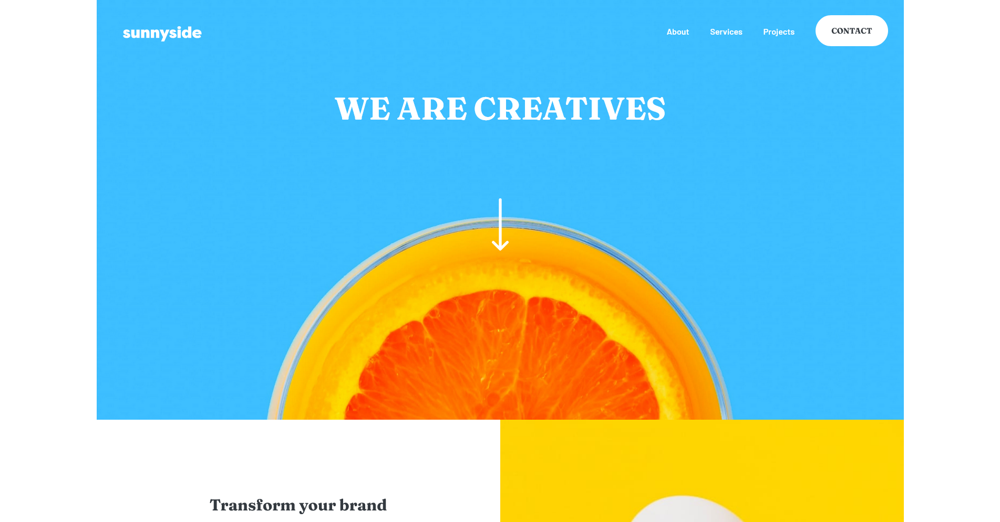

# Sunnyside agency landing page

This was bases in a Frontend mentor challenge in wich I developed an agency landing page.

---

## Screenshot

---

## Live Demo

- Live Site: https://devnielote.github.io/sunnyside-landing/

---

## Project Purpose

- Practicing dynamic navigation based on breakpoints.
- Structuring layouts using CSS grid or flebox.
- Writing maintainable and modular pure CSS.
- Implementing a responsive adaptive layout.

---

## Built with

- Semantic HTML5 markup
- Pure CSS
- CSS Grid and flexbox
- Javascript
- Mobile-first workflow

